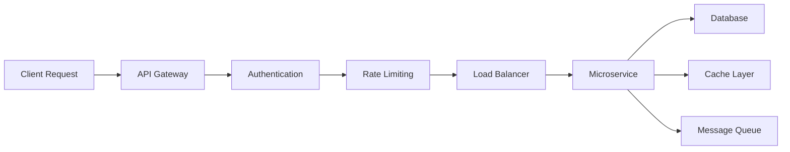

# System Architecture

*Comprehensive overview of our technical infrastructure and design principles*

## 🏗️ **Architecture Overview**

Our technology stack is designed for **scalability**, **reliability**, and **maintainability**. We leverage modern cloud-native architectures, microservices patterns, and open-source technologies to deliver robust automation solutions.

## 🎯 **Design Principles**

### **1. Cloud-Native First**
- **Containerized Applications** - Docker and Kubernetes for orchestration
- **Serverless Functions** - Event-driven compute for optimal resource utilization
- **Infrastructure as Code** - Terraform and GitOps for reproducible deployments
- **Multi-Cloud Strategy** - Vendor independence and disaster recovery

### **2. Microservices Architecture**
- **Domain-Driven Design** - Services aligned with business capabilities
- **API-First Approach** - RESTful and GraphQL APIs for all integrations
- **Event-Driven Communication** - Asynchronous messaging for loose coupling
- **Service Mesh** - Istio for secure, observable service communication

### **3. Data-Centric Design**
- **Event Sourcing** - Complete audit trail and temporal queries
- **CQRS Pattern** - Optimized read and write operations
- **Data Lake Architecture** - Centralized data storage for analytics
- **Real-Time Processing** - Stream processing for immediate insights

## 🔧 **Technology Stack**

### **Frontend & User Experience**

```typescript
// Modern React Stack
- Next.js 15         // Full-stack React framework
- TypeScript         // Type-safe development
- Tailwind CSS       // Utility-first styling
- Radix UI           // Accessible component primitives
- Framer Motion      // Smooth animations
- React Query        // Server state management
```

### **Backend & APIs**

```python
# Microservices Stack
- FastAPI            # High-performance Python APIs
- Node.js            # JavaScript runtime for real-time services
- GraphQL            # Flexible data querying
- gRPC               # High-performance RPC communication
- Redis              # In-memory data structure store
- PostgreSQL         # Relational database
- MongoDB            # Document database for flexible schemas
```

### **Infrastructure & DevOps**

```yaml
# Cloud Infrastructure
- Kubernetes         # Container orchestration
- Docker             # Containerization
- Terraform          # Infrastructure as Code
- GitLab CI/CD       # Continuous integration and deployment
- Prometheus         # Monitoring and alerting
- Grafana            # Observability dashboards
- ELK Stack          # Centralized logging
```

## 🌐 **System Components**

### **Core Platform Services**

<div className="grid grid-cols-1 md:grid-cols-2 gap-6 my-8">
  <div className="p-6 border rounded-lg">
    <h4 className="font-semibold mb-2">🔐 Authentication Service</h4>
    <div className="text-sm text-muted-foreground mb-2">
      OAuth 2.0 / OpenID Connect with JWT tokens
    </div>
    <ul className="text-xs text-muted-foreground space-y-1">
      <li>• Multi-factor authentication</li>
      <li>• Role-based access control</li>
      <li>• Single sign-on (SSO)</li>
    </ul>
  </div>
  
  <div className="p-6 border rounded-lg">
    <h4 className="font-semibold mb-2">📊 Analytics Engine</h4>
    <div className="text-sm text-muted-foreground mb-2">
      Real-time data processing and insights
    </div>
    <ul className="text-xs text-muted-foreground space-y-1">
      <li>• Stream processing with Kafka</li>
      <li>• Machine learning pipelines</li>
      <li>• Custom dashboards</li>
    </ul>
  </div>
  
  <div className="p-6 border rounded-lg">
    <h4 className="font-semibold mb-2">🔄 Automation Engine</h4>
    <div className="text-sm text-muted-foreground mb-2">
      Business process automation and workflows
    </div>
    <ul className="text-xs text-muted-foreground space-y-1">
      <li>• Visual workflow designer</li>
      <li>• Integration connectors</li>
      <li>• Error handling & retries</li>
    </ul>
  </div>
  
  <div className="p-6 border rounded-lg">
    <h4 className="font-semibold mb-2">🔗 Integration Hub</h4>
    <div className="text-sm text-muted-foreground mb-2">
      Universal connector for third-party systems
    </div>
    <ul className="text-xs text-muted-foreground space-y-1">
      <li>• REST/SOAP/GraphQL APIs</li>
      <li>• Database connectors</li>
      <li>• Legacy system bridges</li>
    </ul>
  </div>
</div>

## 🔄 **Data Flow Architecture**

### **Request Processing Pipeline**



### **Event-Driven Architecture**

```typescript
// Event Flow Example
interface BusinessEvent {
  id: string
  type: 'automation.workflow.started' | 'user.action.completed'
  timestamp: Date
  payload: Record<string, unknown>
  metadata: {
    source: string
    version: string
    correlationId: string
  }
}

// Event Handlers
const eventHandlers = {
  'automation.workflow.started': handleWorkflowStart,
  'user.action.completed': handleUserAction,
  'integration.data.received': processIncomingData
}
```

## 🚀 **Scalability Strategy**

### **Horizontal Scaling**
- **Auto-scaling Groups** - Dynamic capacity based on demand
- **Container Orchestration** - Kubernetes HPA (Horizontal Pod Autoscaler)
- **Database Sharding** - Distributed data across multiple instances
- **CDN Integration** - Global content delivery for static assets

### **Performance Optimization**
- **Caching Layers** - Redis for session and application caching
- **Database Optimization** - Query optimization and read replicas
- **Asset Optimization** - Image compression and lazy loading
- **Connection Pooling** - Efficient database connection management

## 🔒 **Security Architecture**

### **Defense in Depth**

```typescript
// Security Layers
const securityLayers = {
  network: [
    'VPC with private subnets',
    'Web Application Firewall (WAF)',
    'DDoS protection',
    'SSL/TLS encryption'
  ],
  application: [
    'Input validation and sanitization',
    'SQL injection prevention',
    'XSS protection',
    'CSRF tokens'
  ],
  data: [
    'Encryption at rest',
    'Encryption in transit',
    'Key management (KMS)',
    'Data anonymization'
  ]
}
```

### **Compliance & Standards**
- **SOC 2 Type II** - Security controls and processes
- **GDPR Compliance** - Data protection and privacy
- **ISO 27001** - Information security management
- **OWASP Top 10** - Web application security

## 📊 **Monitoring & Observability**

### **Three Pillars of Observability**

<div className="grid grid-cols-1 md:grid-cols-3 gap-4 my-6">
  <div className="p-4 border rounded-lg text-center">
    <h4 className="font-semibold mb-2">📈 Metrics</h4>
    <div className="text-sm text-muted-foreground">
      Prometheus & Grafana for system metrics
    </div>
  </div>
  
  <div className="p-4 border rounded-lg text-center">
    <h4 className="font-semibold mb-2">📝 Logs</h4>
    <div className="text-sm text-muted-foreground">
      ELK Stack for centralized logging
    </div>
  </div>
  
  <div className="p-4 border rounded-lg text-center">
    <h4 className="font-semibold mb-2">🔍 Traces</h4>
    <div className="text-sm text-muted-foreground">
      Jaeger for distributed tracing
    </div>
  </div>
</div>

### **Key Performance Indicators**

- **System Uptime** - 99.9% availability target
- **Response Time** - P95 < 200ms for API calls
- **Error Rate** - < 0.1% for critical operations
- **Throughput** - Requests per second capacity
- **Resource Utilization** - CPU, memory, and storage metrics

## 🔄 **Deployment Strategy**

### **Blue-Green Deployments**
- **Zero-downtime deployments** - Seamless user experience
- **Instant rollback capability** - Quick recovery from issues
- **Environment parity** - Consistent staging and production

### **GitOps Workflow**

```yaml
# Deployment Pipeline
stages:
  - build:
      - Unit tests
      - Code quality checks
      - Security scanning
      - Docker image build
  
  - deploy-staging:
      - Infrastructure provisioning
      - Application deployment
      - Integration tests
      - Performance tests
  
  - deploy-production:
      - Manual approval gate
      - Blue-green deployment
      - Health checks
      - Monitoring validation
```

## 📱 **API Design**

### **RESTful API Standards**

```typescript
// API Response Format
interface APIResponse<T> {
  data: T
  meta: {
    timestamp: string
    version: string
    requestId: string
  }
  links?: {
    self: string
    next?: string
    prev?: string
  }
}

// Error Response Format
interface APIError {
  error: {
    code: string
    message: string
    details?: Record<string, unknown>
  }
  meta: {
    timestamp: string
    requestId: string
  }
}
```

### **GraphQL Schema Design**

```graphql
type Query {
  automation(id: ID!): Automation
  automations(filter: AutomationFilter): [Automation!]!
  metrics(timeRange: TimeRange!): Metrics
}

type Mutation {
  createAutomation(input: CreateAutomationInput!): Automation!
  updateAutomation(id: ID!, input: UpdateAutomationInput!): Automation!
  executeWorkflow(id: ID!): WorkflowExecution!
}

type Subscription {
  workflowProgress(workflowId: ID!): WorkflowEvent!
  systemHealth: HealthStatus!
}
```

## 🌟 **Future Architecture Considerations**

### **Emerging Technologies**
- **Edge Computing** - Reduce latency with edge deployments
- **WebAssembly** - High-performance browser-based processing
- **Quantum Computing** - Advanced optimization algorithms
- **AI/ML Integration** - Intelligent automation decisions

### **Sustainability Goals**
- **Carbon-neutral infrastructure** - Green cloud providers
- **Efficient resource usage** - Optimized compute allocation
- **Serverless adoption** - Pay-per-use model for better efficiency
- **Edge optimization** - Reduced data transfer and processing

---

## 📚 **Related Documentation**

- [**Technical Stack Details**](/docs/architecture/technical-stack) - Deep dive into our technology choices
- [**Infrastructure Guide**](/docs/architecture/infrastructure) - Deployment and operations
- [**Development Patterns**](/docs/development/patterns) - Coding standards and practices
- [**Security Guidelines**](/docs/development/security) - Security implementation details

**Questions about our architecture?** [Join the discussion](/docs/community/discussions) or [contact our technical team](/docs/community/support). 